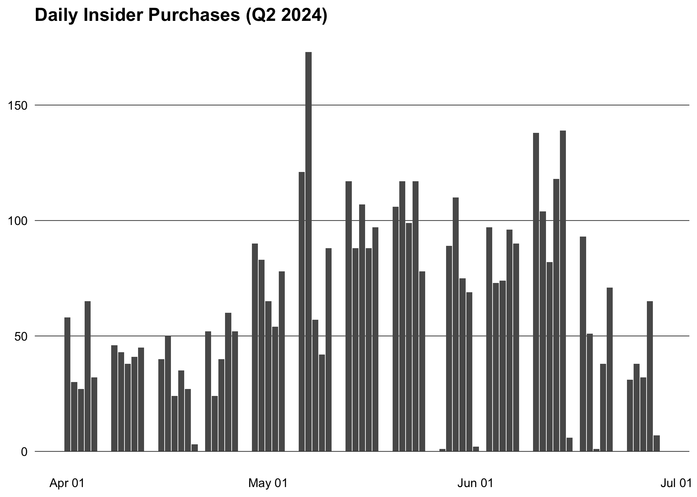

<!-- README.md is generated from README.Rmd. Please edit that file -->

# insidertrade

<!-- badges: start -->

[](https://lifecycle.r-lib.org/articles/stages.html#experimental)
<!-- badges: end -->

## Overview

insidertrade provides access to SEC insider trading data (Forms 3/4/5)
from two sources:

- [Insider transactions bulk data
  sets](https://www.sec.gov/data-research/sec-markets-data/insider-transactions-data-sets)
  (quarterly TSV downloads)
- [EDGAR submissions
  API](https://www.sec.gov/search-filings/edgar-application-programming-interfaces)
  (company filing metadata)

## Installation

You can install the development version from
[GitHub](https://github.com/) with:

``` r
# install.packages("pak")
pak::pak("m-muecke/insidertrade")
```

## Usage

``` r
library(data.table)
library(insidertrade)

# download and parse all Form 3/4/5 tables for Q2 2024
data <- sec_form345(2025, 4)
str(lapply(data, dim))
#> List of 8
#>  $ deriv_holding   : int [1:2] 8223 26
#>  $ deriv_trans     : int [1:2] 20439 42
#>  $ footnotes       : int [1:2] 88855 3
#>  $ nonderiv_holding: int [1:2] 17521 14
#>  $ nonderiv_trans  : int [1:2] 59678 28
#>  $ owner_signature : int [1:2] 39295 3
#>  $ reportingowner  : int [1:2] 39602 13
#>  $ submission      : int [1:2] 36421 14

# get transactions joined with submission and owner details
trans <- sec_transactions(2025, 4)

# filter to open-market purchases by officers and directors
buys <- trans[
  trans_code == "P" &
    grepl("Officer|Director", rptowner_relationship) &
    trans_date >= "2025-10-01" &
    trans_date <= "2025-12-31"
]

# top 10 companies by number of distinct insider buyers
buys[, value := trans_shares * trans_pricepershare]
top <- buys[,
  .(n_insiders = uniqueN(rptownercik), total_usd = sum(value, na.rm = TRUE)),
  by = .(ticker = issuertradingsymbol, company = issuername)
]
setorder(top, -n_insiders, -total_usd)
head(top, 10)
#>         ticker                           company n_insiders total_usd
#>         <char>                            <char>      <int>     <num>
#>  1:        CBC          Central Bancompany, Inc.         17   5104827
#>  2:       MTDR              Matador Resources Co         13   1522756
#>  3:        VAC MARRIOTT VACATIONS WORLDWIDE Corp         12  18231582
#>  4:       HYNE               Hoyne Bancorp, Inc.         10   2428916
#>  5:        OBK              Origin Bancorp, Inc.         10   1023669
#>  6:        CRM                  Salesforce, Inc.          9 200626167
#>  7:        LAB            STANDARD BIOTOOLS INC.          8 115266000
#>  8:       ZBIO             Zenas BioPharma, Inc.          8  33252661
#>  9:        XZO                 Exzeo Group, Inc.          8   2527329
#> 10: HEI, HEI.A                        HEICO CORP          8   1416726

# plot insider purchases over the quarter
library(ggplot2)

daily <- buys[,
  .(n_purchases = .N, total_shares = sum(trans_shares, na.rm = TRUE)),
  by = trans_date
]

ggplot(daily, aes(x = trans_date, y = n_purchases)) +
  geom_col() +
  scale_x_date(date_labels = "%b %d") +
  theme_minimal() +
  theme(
    plot.title = element_text(face = "bold"),
    panel.grid.major.y = element_line(color = "black", linewidth = 0.2),
    panel.grid.major.x = element_blank(),
    panel.grid.minor = element_blank(),
    axis.text = element_text(color = "black"),
    axis.title = element_blank()
  ) +
  labs(title = "Daily Insider Purchases (Q4 2025)")
```



You can also look up companies by ticker and fetch their insider filings
from EDGAR:

``` r
tickers <- sec_tickers()
cik <- tickers[ticker == "AAPL", cik]
edgar_insider_filings(cik)
#>           accessionnumber filing_date reportdate acceptance_datetime    act
#>                    <char>      <Date>     <char>              <POSc> <char>
#>   1: 0001780525-26-000003  2026-03-06 2026-03-01 2026-03-06 18:30:51
#>   2: 0001059235-26-000004  2026-02-26 2026-02-24 2026-02-26 18:34:19
#>   3: 0001216519-26-000004  2026-02-26 2026-02-24 2026-02-26 18:33:49
#>   4: 0001179864-26-000004  2026-02-26 2026-02-24 2026-02-26 18:33:14
#>   5: 0001214128-26-000004  2026-02-26 2026-02-24 2026-02-26 18:32:41
#>  ---
#> 604: 0001181431-15-004549  2015-03-12 2015-03-10 2015-03-12 18:34:12
#> 605: 0001181431-15-004548  2015-03-12 2015-03-10 2015-03-12 18:33:47
#> 606: 0001181431-15-004547  2015-03-12 2015-03-10 2015-03-12 18:33:20
#> 607: 0001181431-15-004546  2015-03-12 2015-03-10 2015-03-12 18:32:46
#> 608: 0001181431-15-004545  2015-03-12 2015-03-10 2015-03-12 18:32:12
#>        form filenumber filmnumber  items core_type   size isxbrl isinlinexbrl
#>      <char>     <char>     <char> <char>    <char>  <int>  <int>        <int>
#>   1:      3                                      3 490535      0            0
#>   2:      4                                      4   5753      0            0
#>   3:      4                                      4   5760      0            0
#>   4:      4                                      4   5734      0            0
#>   5:      4                                      4   7816      0            0
#>  ---
#> 604:      4                                      4   5481      0            0
#> 605:      4                                      4   5481      0            0
#> 606:      4                                      4   5499      0            0
#> 607:      4                                      4   5473      0            0
#> 608:      4                                      4   5471      0            0
#>                         primarydocument                  primarydocdescription
#>                                  <char>                                 <char>
#>   1: xslF345X02/wk-form3_1772839848.xml                                 FORM 3
#>   2: xslF345X05/wk-form4_1772148856.xml                                 FORM 4
#>   3: xslF345X05/wk-form4_1772148826.xml                                 FORM 4
#>   4: xslF345X05/wk-form4_1772148791.xml                                 FORM 4
#>   5: xslF345X05/wk-form4_1772148758.xml                                 FORM 4
#>  ---
#> 604:           xslF345X03/rrd423481.xml     2015.03.10 IGER FORM 4 - RSU GRANT
#> 605:           xslF345X03/rrd423482.xml     2015.03.10 JUNG FORM 4 - RSU GRANT
#> 606:           xslF345X03/rrd423483.xml 2015.03.10 LEVINSON FORM 4 - RSU GRANT
#> 607:           xslF345X03/rrd423484.xml    2015.03.10 SUGAR FORM 4 - RSU GRANT
#> 608:           xslF345X03/rrd423485.xml   2015.03.10 WAGNER FORM 4 - RSU GRANT
```

## Related work

- [insiderTrades](https://github.com/US-Department-of-the-Treasury/insiderTrades)
- [finreportr](https://github.com/sewardlee337/finreportr)
- [edgarWebR](https://github.com/mwaldstein/edgarWebR)
- [finstr](https://github.com/bergant/finstr)
- [tidyedgar](https://cran.r-project.org/package=tidyedgar)
- [XBRL](https://cran.r-project.org/package=XBRL)
