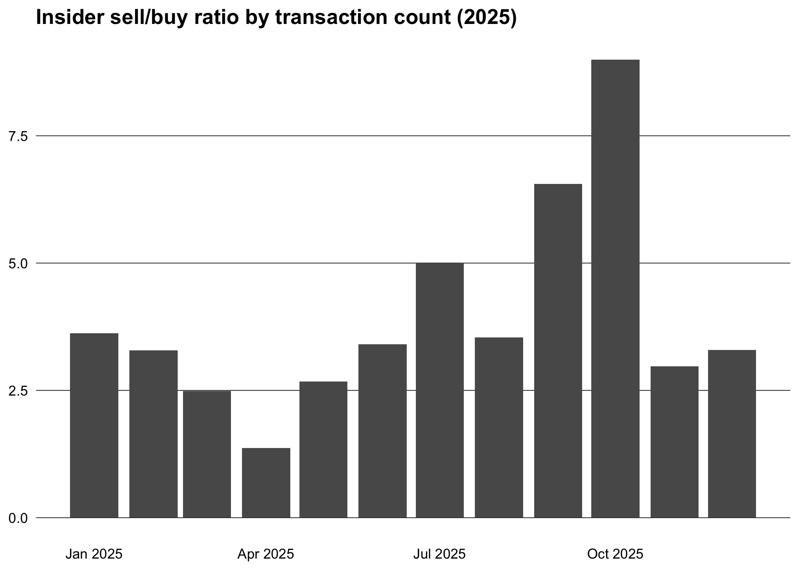
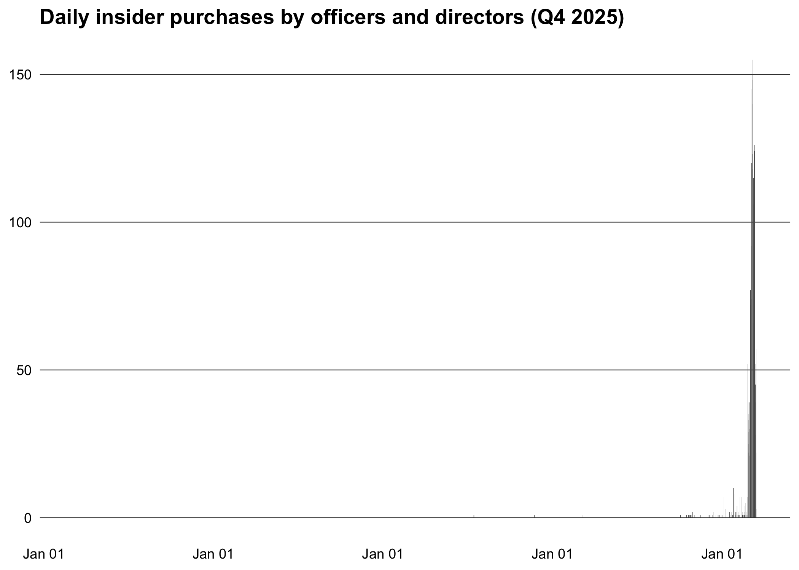

# insidertrade

## Overview

insidertrade provides access to SEC insider trading data (Forms 3/4/5)
from two sources:

- [Insider transactions bulk data
  sets](https://www.sec.gov/data-research/sec-markets-data/insider-transactions-data-sets)
  (quarterly TSV downloads)
- [EDGAR
  API](https://www.sec.gov/search-filings/edgar-application-programming-interfaces)
  (company filing metadata and Form 4 XML transaction details)

## Installation

You can install the development version from
[GitHub](https://github.com/) with:

``` r
# install.packages("pak")
pak::pak("m-muecke/insidertrade")
```

## Configuration

The SEC requires a valid User-Agent with contact information for all API
requests. Set this once per session before making any calls:

``` r
options(insidertrade.user_agent = "your@email.com")
```

Optionally, enable caching to avoid re-downloading data:

``` r
options(insidertrade.cache = TRUE)
```

## Usage

``` r
library(data.table)
library(insidertrade)
```

### Bulk data

Download and parse all Form 3/4/5 tables for 2025:

``` r
trans <- sec_transactions(2025)
```

### Open-market purchases

Filter to open-market purchases (code `"P"`) by officers and directors —
the most informative signal for insider sentiment:

``` r
buys <- trans[
  trans_code == "P" &
    grepl("Officer|Director", rptowner_relationship) &
    trans_date >= "2025-01-01" & trans_date <= "2025-12-31"
]
buys[, let(value = trans_shares * trans_pricepershare)]
```

### Top insider buys

Rank companies by the number of distinct insider buyers:

``` r
top <- buys[,
  .(n_insiders = uniqueN(rptownercik), total_usd = sum(value, na.rm = TRUE)),
  by = .(ticker = issuertradingsymbol, company = issuername)
]
setorder(top, -n_insiders, -total_usd)
head(top, 10)
#>     ticker                           company n_insiders  total_usd
#>     <char>                            <char>      <int>      <num>
#>  1:   ACTU        ACTUATE THERAPEUTICS, INC.         24   11999904
#>  2:   EFSI      EAGLE FINANCIAL SERVICES INC         21     596869
#>  3:   ALKT           ALKAMI TECHNOLOGY, INC.         19  534703590
#>  4:    CBC          Central Bancompany, Inc.         17    5104827
#>  5:   MTDR              Matador Resources Co         17    4647941
#>  6:   KYMR         Kymera Therapeutics, Inc.         16 1347604988
#>  7:   AVBH           Avidbank Holdings, Inc.         16    3488755
#>  8:   WSBC                      WESBANCO INC         15    1556841
#>  9:    VAC MARRIOTT VACATIONS WORLDWIDE Corp         14  222259811
#> 10:    HPP   Hudson Pacific Properties, Inc.         14    2564984
```

### Cluster buys

Identify stocks where 3 or more insiders bought within the year — a
strong bullish signal:

``` r
cluster <- buys[,
  .(
    n_insiders = uniqueN(rptownercik),
    total_usd = sum(value, na.rm = TRUE),
    first_buy = min(trans_date),
    last_buy = max(trans_date)
  ),
  by = .(ticker = issuertradingsymbol, company = issuername)
][n_insiders >= 3L]
setorder(cluster, -n_insiders, -total_usd)
head(cluster, 10)
#>     ticker                           company n_insiders  total_usd  first_buy
#>     <char>                            <char>      <int>      <num>     <Date>
#>  1:   ACTU        ACTUATE THERAPEUTICS, INC.         24   11999904 2025-06-27
#>  2:   EFSI      EAGLE FINANCIAL SERVICES INC         21     596869 2025-02-07
#>  3:   ALKT           ALKAMI TECHNOLOGY, INC.         19  534703590 2025-05-15
#>  4:    CBC          Central Bancompany, Inc.         17    5104827 2025-11-21
#>  5:   MTDR              Matador Resources Co         17    4647941 2025-02-21
#>  6:   KYMR         Kymera Therapeutics, Inc.         16 1347604988 2025-06-30
#>  7:   AVBH           Avidbank Holdings, Inc.         16    3488755 2025-08-07
#>  8:   WSBC                      WESBANCO INC         15    1556841 2025-05-22
#>  9:    VAC MARRIOTT VACATIONS WORLDWIDE Corp         14  222259811 2025-03-04
#> 10:    HPP   Hudson Pacific Properties, Inc.         14    2564984 2025-06-12
#>       last_buy
#>         <Date>
#>  1: 2025-06-27
#>  2: 2025-07-31
#>  3: 2025-08-13
#>  4: 2025-11-21
#>  5: 2025-11-06
#>  6: 2025-12-11
#>  7: 2025-08-08
#>  8: 2025-10-30
#>  9: 2025-11-25
#> 10: 2025-06-12
```

### Buy/sell ratio

Compute the market-wide buy/sell ratio by month — a classic contrarian
indicator. High sell ratios historically correlate with market tops:

``` r
library(ggplot2)

open_market <- trans[
  trans_code %in% c("P", "S") & trans_date >= "2025-01-01" & trans_date <= "2025-12-31"
]
open_market[, let(month = as.Date(format(trans_date, "%Y-%m-01")))]
ratio <- open_market[,
  .(n_buys = sum(trans_code == "P"), n_sells = sum(trans_code == "S")),
  by = month
]
ratio[, let(sell_buy_ratio = n_sells / n_buys)]

ggplot(ratio, aes(x = month, y = sell_buy_ratio)) +
  geom_col() +
  scale_x_date(date_labels = "%b %Y") +
  theme_minimal() +
  theme(
    plot.title = element_text(face = "bold"),
    panel.grid.major.y = element_line(color = "black", linewidth = 0.2),
    panel.grid.major.x = element_blank(),
    panel.grid.minor = element_blank(),
    axis.text = element_text(color = "black"),
    axis.title = element_blank()
  ) +
  labs(title = "Insider sell/buy ratio by transaction count (2025)")
```



### Daily purchase activity

``` r
daily <- buys[, .(n_purchases = .N, total_usd = sum(value, na.rm = TRUE)), by = trans_date]

ggplot(daily, aes(x = trans_date, y = n_purchases)) +
  geom_col() +
  scale_x_date(date_labels = "%b %d") +
  theme_minimal() +
  theme(
    plot.title = element_text(face = "bold"),
    panel.grid.major.y = element_line(color = "black", linewidth = 0.2),
    panel.grid.major.x = element_blank(),
    panel.grid.minor = element_blank(),
    axis.text = element_text(color = "black"),
    axis.title = element_blank()
  ) +
  labs(title = "Daily insider purchases by officers and directors (2025)")
```



### EDGAR API

Look up a company by ticker and fetch their insider filings:

``` r
tickers <- sec_tickers()
cik <- tickers[ticker == "AAPL", cik]
filings <- edgar_insider_filings(cik)
filings
#>           accessionnumber filing_date reportdate acceptance_datetime    act
#>                    <char>      <Date>     <char>              <POSc> <char>
#>   1: 0001780525-26-000003  2026-03-06 2026-03-01 2026-03-06 18:30:51       
#>   2: 0001059235-26-000004  2026-02-26 2026-02-24 2026-02-26 18:34:19       
#>   3: 0001216519-26-000004  2026-02-26 2026-02-24 2026-02-26 18:33:49       
#>   4: 0001179864-26-000004  2026-02-26 2026-02-24 2026-02-26 18:33:14       
#>   5: 0001214128-26-000004  2026-02-26 2026-02-24 2026-02-26 18:32:41       
#>  ---                                                                       
#> 604: 0001181431-15-004549  2015-03-12 2015-03-10 2015-03-12 18:34:12       
#> 605: 0001181431-15-004548  2015-03-12 2015-03-10 2015-03-12 18:33:47       
#> 606: 0001181431-15-004547  2015-03-12 2015-03-10 2015-03-12 18:33:20       
#> 607: 0001181431-15-004546  2015-03-12 2015-03-10 2015-03-12 18:32:46       
#> 608: 0001181431-15-004545  2015-03-12 2015-03-10 2015-03-12 18:32:12       
#>        form filenumber filmnumber  items core_type   size isxbrl isinlinexbrl
#>      <char>     <char>     <char> <char>    <char>  <int>  <int>        <int>
#>   1:      3                                      3 490535      0            0
#>   2:      4                                      4   5753      0            0
#>   3:      4                                      4   5760      0            0
#>   4:      4                                      4   5734      0            0
#>   5:      4                                      4   7816      0            0
#>  ---                                                                         
#> 604:      4                                      4   5481      0            0
#> 605:      4                                      4   5481      0            0
#> 606:      4                                      4   5499      0            0
#> 607:      4                                      4   5473      0            0
#> 608:      4                                      4   5471      0            0
#>                         primarydocument                  primarydocdescription
#>                                  <char>                                 <char>
#>   1: xslF345X02/wk-form3_1772839848.xml                                 FORM 3
#>   2: xslF345X05/wk-form4_1772148856.xml                                 FORM 4
#>   3: xslF345X05/wk-form4_1772148826.xml                                 FORM 4
#>   4: xslF345X05/wk-form4_1772148791.xml                                 FORM 4
#>   5: xslF345X05/wk-form4_1772148758.xml                                 FORM 4
#>  ---                                                                          
#> 604:           xslF345X03/rrd423481.xml     2015.03.10 IGER FORM 4 - RSU GRANT
#> 605:           xslF345X03/rrd423482.xml     2015.03.10 JUNG FORM 4 - RSU GRANT
#> 606:           xslF345X03/rrd423483.xml 2015.03.10 LEVINSON FORM 4 - RSU GRANT
#> 607:           xslF345X03/rrd423484.xml    2015.03.10 SUGAR FORM 4 - RSU GRANT
#> 608:           xslF345X03/rrd423485.xml   2015.03.10 WAGNER FORM 4 - RSU GRANT
```

### Form 4 transaction details

Parse the Form 4 XML to see the actual transactions — what was traded,
how many shares, and at what price:

``` r
form4s <- filings[form == "4"]
txns <- rbindlist(lapply(seq_len(min(10L, nrow(form4s))), function(i) {
  edgar_form4(cik, form4s$accessionnumber[i], form4s$primarydocument[i])
}))
txns[, .(owner_name, transaction_date, transaction_code, security_title, shares, price_per_share)]
#>           owner_name transaction_date transaction_code security_title shares
#>               <char>           <Date>           <char>         <char>  <num>
#> 1: LEVINSON ARTHUR D       2026-02-26                G   Common Stock   1113
#> 2:      WAGNER SUSAN       2026-02-01                M   Common Stock   1255
#> 3:    SUGAR RONALD D       2026-02-01                M   Common Stock   1255
#> 4:   LOZANO MONICA C       2026-02-01                M   Common Stock   1255
#>    price_per_share
#>              <num>
#> 1:               0
#> 2:              NA
#> 3:              NA
#> 4:              NA
```

## Related work

- [insiderTrades](https://github.com/US-Department-of-the-Treasury/insiderTrades)
- [finreportr](https://github.com/sewardlee337/finreportr)
- [edgarWebR](https://github.com/mwaldstein/edgarWebR)
- [finstr](https://github.com/bergant/finstr)
- [tidyedgar](https://cran.r-project.org/package=tidyedgar)
- [XBRL](https://cran.r-project.org/package=XBRL)
